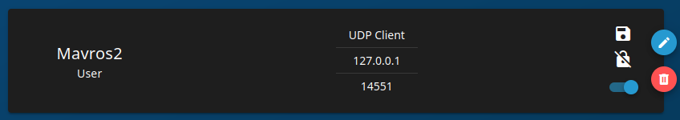

# Pi Main

## Overview

This package launches the rest of the Pi packages. It should be run on Pi boot up.

## Setup

### Flashing

If something ever happens to the Pi follow [this](https://www.jeffgeerling.com/blog/2020/how-flash-raspberry-pi-os-compute-module-4-emmc-usbboot) tutorial on reflashing it. In Raspberry Pi imager, set the following configuration options:
- username: `rov`
- password: `rov12345`
- enable ssh (use password authentication)

Connect a monitor and keyboard to the pi (use the compute module IO board if needed). Connect to a router over ethernet (not to a CWRU network switch). Log in as `rov` with password `rov12345`. Run `ip a` and find the IPv4 address under the default ethernet adapter. Connect your laptop to the router via WiFi or Ethernet and run (on your laptop) `ssh rov@<pi's IP address>`.

### Install BlueOS
Follow the [BlueOS manual install instructions](https://blueos.cloud/docs/1.0/usage/installation/). This command should be sufficient:
`sudo su -c 'curl -fsSL https://raw.githubusercontent.com/bluerobotics/blueos-docker/master/install/install.sh | bash'`

### Configure BlueOS
- While connceted to the pi via ethernet, visit the BlueOS web dashboard at 192.168.2.2
- Enable pirate mode by clicking on the skull and crossbones in the top right.
- Go to the 'Mavlink Endpoints' tab and create a new UDP client endpoint with address 127.0.0.1 and port 14551.

- SSH into the pi (rov@192.168.2.2) and edit `/boot/firmware/config.txt`. Add these lines at the end to enable the i2c 4 bus:
```
[all]
dtoverlay=i2c4,pins_6_7,baudrate=1000000
```

### Setup ad-hoc network between two Ubuntu devices
**This is no longer necessary with BlueOS**

Do this to get two Ubuntu devices to network over a single ethernet cable.

Run the following commands on both devices:

```bash
sudo nmcli connection add type ethernet ifname eth0
sudo nmcli connection modify ethernet-eth0 ipv4.method link-local
nmcli connection up ethernet-eth0
```

### Setup Laptop for Direct Ethernet Access

#### Linux

1. Open Advanced Network Configuration applet

2. Select the network under Ethernet

3. Under IPv4 Settings set the Method `Shared to other computers`

4. Set the Address to 192.168.2.1 and the Netmask to 24

#### Windows

1. On Windows, search "view network connections" in the search bar, this should bring you to the control panel.

    

2. Right click on your wifi adapter and click on "Properties".

    

3. Go to the "sharing" tab.

    

4. Check both checkboxes, and accept any popups. If there is a dropdown menu, select your ethernet adapter. Press "OK".

    

5. Now right click on your ethernet adapter and choose "Properties".

    

6. Double click on "Internet Protocol Version 4".

    

7. Set the IP address to "192.168.2.1". Set the subnet mask to "255.255.255.0". **The IP address in this image is incorrect.**

    

## Testing

1. In the terminal, run `ssh rov@192.168.2.2` The password should be `rov12345`.

2. You are now connected to the Pi! You should be able to `ping google.com` and see a reply, indicating that the Pi has access to the internet.

## Installation

Start by cloning the repo:
```bash
git clone git@github.com:CWRUbotix/rov-25.git
```

Run the script to install ros and dependencies:
```bash
sudo bash .vscode/pi_setup.sh
```

Build the ros project
```bash
colcon build
```

You need to run these commands to get the launch file running on Pi boot:

```bash
ros2 run pi_main install
```

```bash
sudo systemctl daemon-reload && sudo systemctl start pi_main
```

These commands should be run in the `src` folder after a colcon build in the workspace folder.

WARNING: Python packages must be installed with sudo for startup code to see them.

### Adding udev Rules

This should automatically be done by the prior command `ros2 run pi_main install`. If not, copy all the .rules files from `udev_rules` in this package to the `/etc/udev/rules.d` directory to use USB devices properly.

If you're setting this up to test on a regular laptop, don't run `ros2 run pi_main install` (you don't want the whole ROV environment config). Instead, just copy the udev rules into `/etc/udev/rules.d`.

Use `udevadm info /dev/...` and `udevadm test /dev/...` to test specific devices if `/dev/ttyPixhawk` doesn't show up on reboot. Pixhawk might appear under `/dev/ACM0`. `lsusb` should show it, along with product & vendor IDs (see udev rule ATTRs):

```
Bus 001 Device 001: ID 1d6b:0002 Linux Foundation 2.0 root hub
Bus 001 Device 004: ID 26ac:0011 3D Robotics PX4 FMU v2.x
```

=>

```
SUBSYSTEMS=="usb", ATTRS{idVendor}=="26ac", ATTRS{idProduct}=="0011", SYMLINK+="ttyPixhawk", MODE="0666"
```

## Usage

### Testing without Rebooting

Installing & setting up this package creates a startup task called `pi_main`. You can manually start and stop this task. I had the `pi_main.service` located in `/etc/systemd/system/pi_main.service`.

To run the `pi_main` task in the background (happens on Pi startup):

```bash
sudo systemctl start pi_main.service
```

To kill the `pi_main` background task (**do this before starting the foreground task**):
```bash
sudo systemctl stop pi_main.service
```
To run the `pi_main` task in the foreground runs the shell scripst in the pi_main/scripts folder.

```bash
source pi_main.sh
```

To get output of task

```bash
sudo journalctl -f -u pi_main.service
```

### Slow Boot Times?
Note: this section is likely not applicable to BlueOS.

This occurs because the below service waits for internet before allowing boot.

Note `systemctl disable systemd-networkd-wait-online` does not work. The disable option is really more of a suggestion than an actual disable.

[](https://emoji.gg/emoji/4111-pensivecowboybread)

```bash
systemctl mask systemd-networkd-wait-online
```

### Blue Navigator
The flight control software is called [ArduSub](https://www.ardusub.com/).

Currently we have [Vectored ROV w/ Four Vertical Thrusters](https://www.ardusub.com/quick-start/vehicle-frame.html) vehicle frame.


## Nodes

There are no nodes in this package.

## Launch files

* **pi_launch.py**: launch the manipulators, camera streaming, and pixhawk packages

